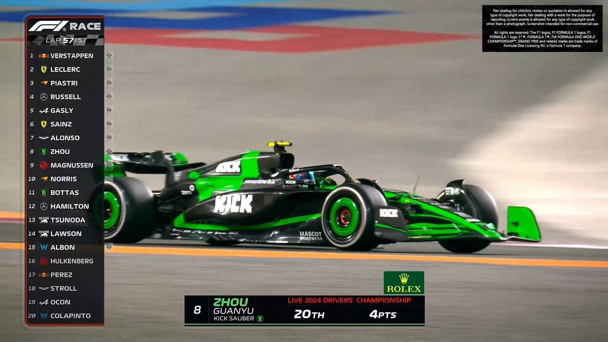
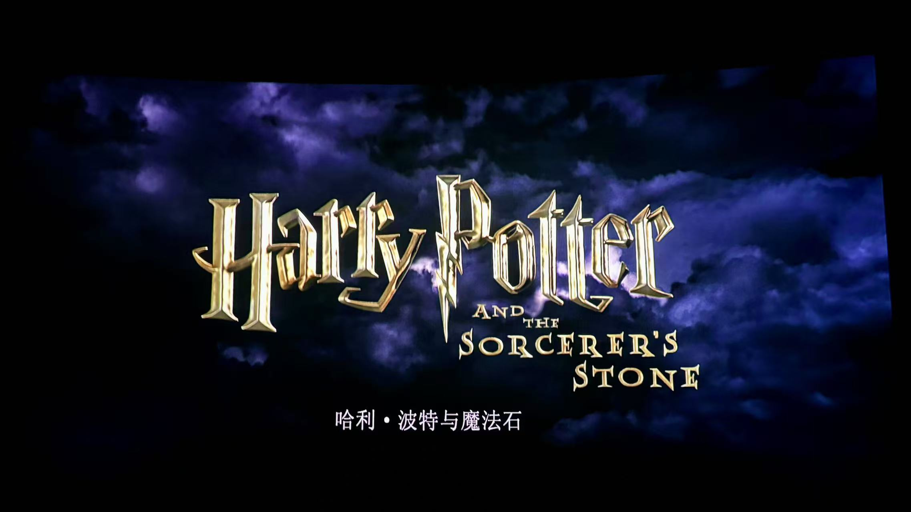
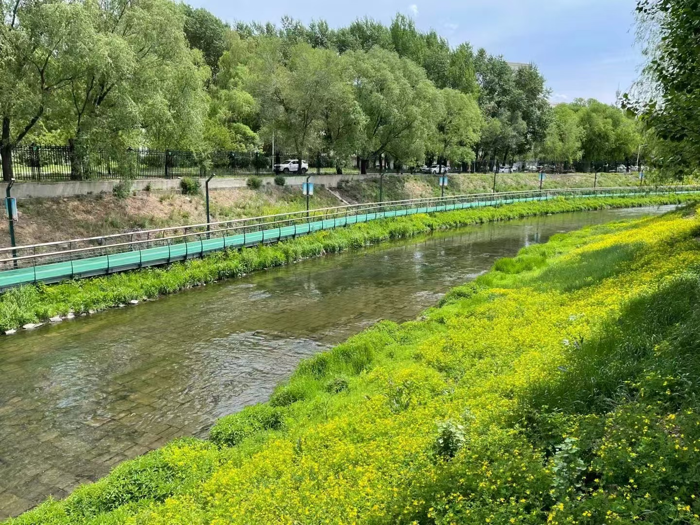
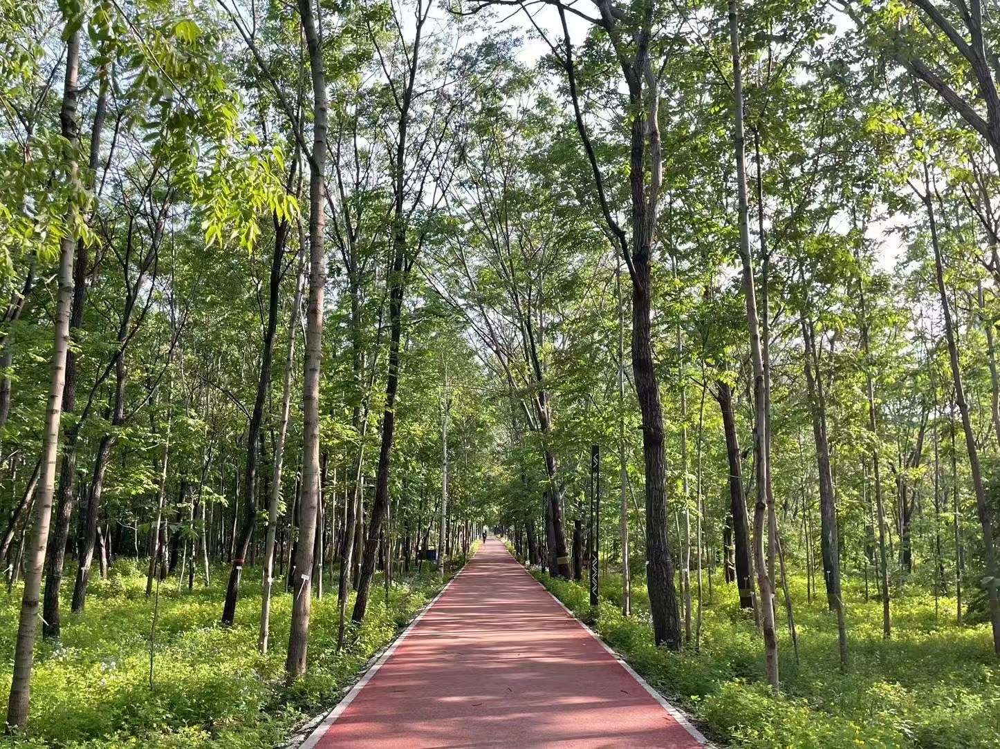
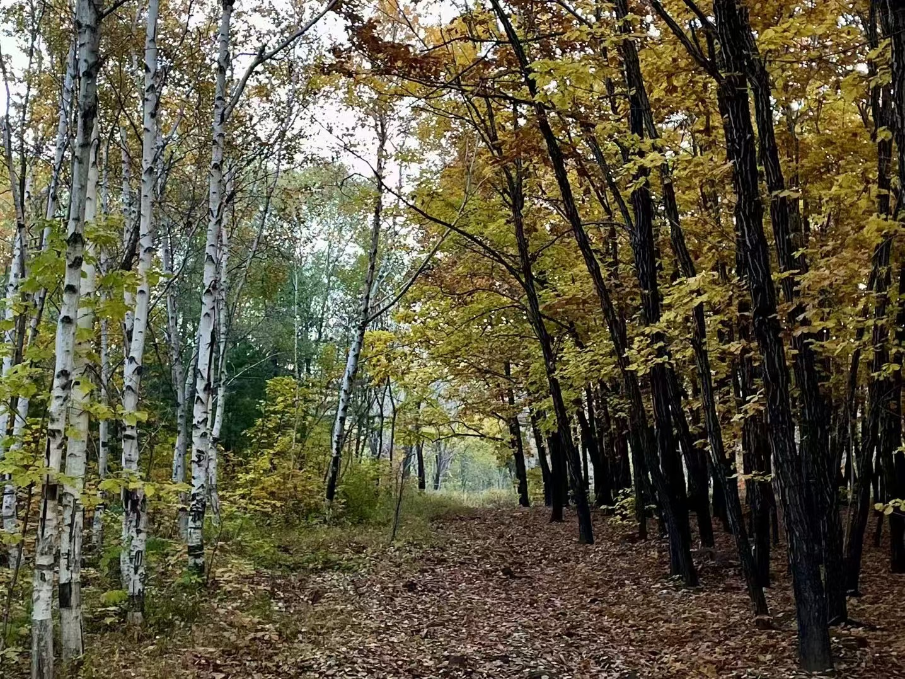
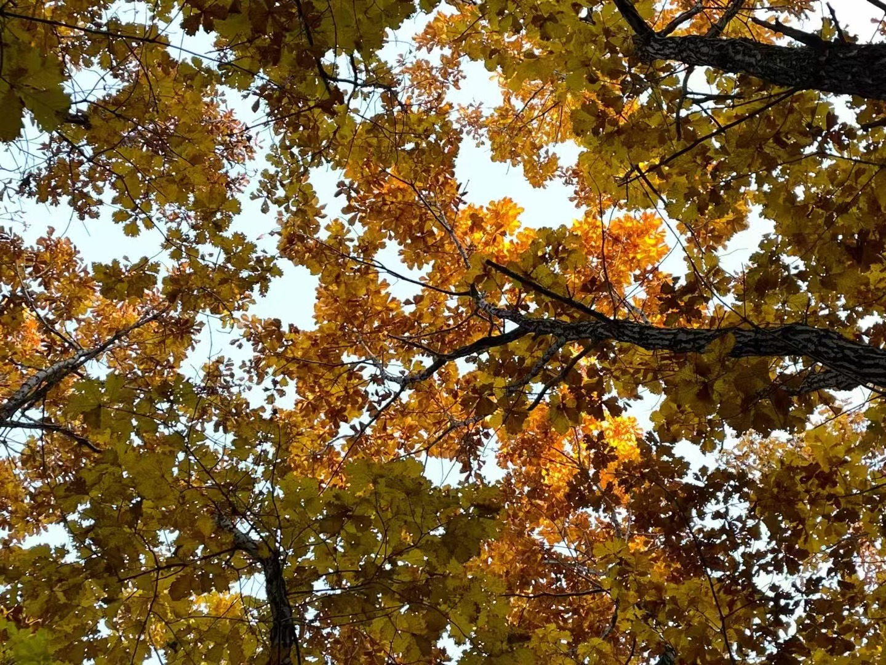
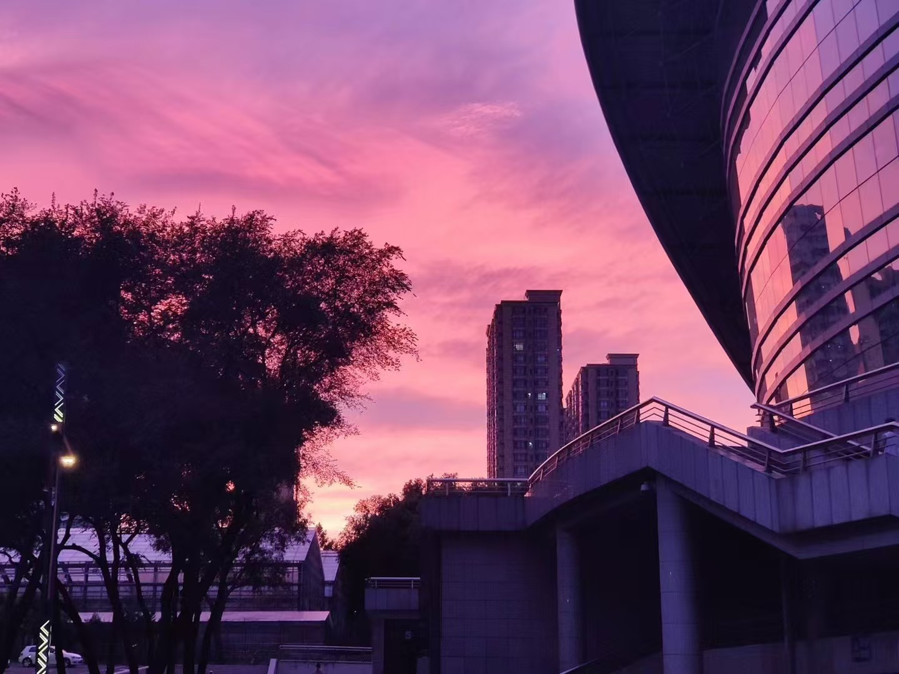
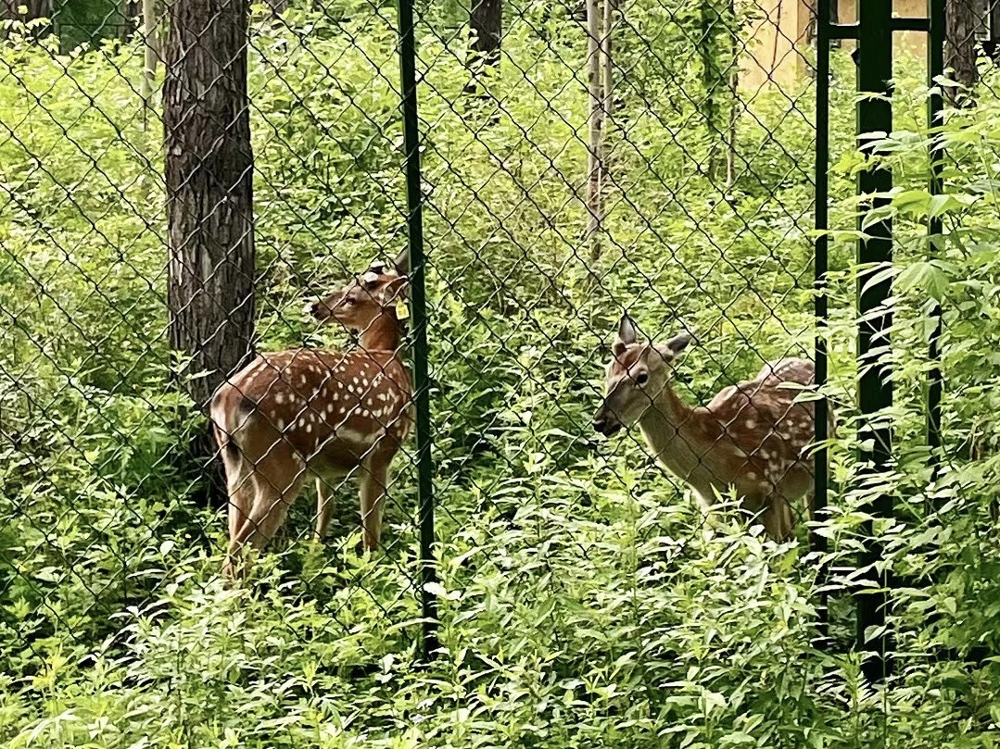
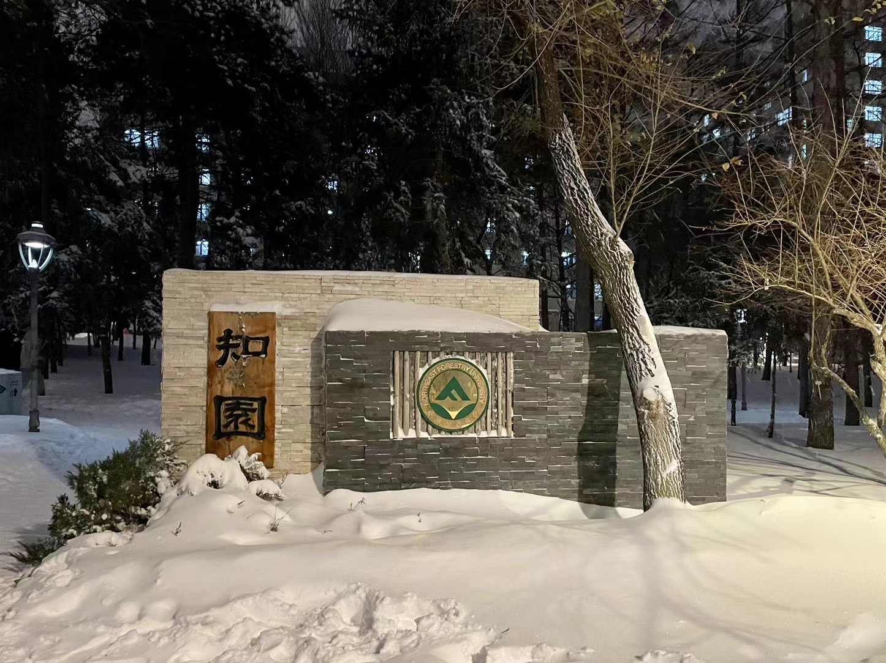








I am currently a senior undergraduate student majoring in Communication Engineering at [Northeast Forestry University](https://www.nefu.edu.cn/). My research interests include Knowledge Graph(KG), Multimodal Large Language Model(MLLM), and LLM reasoning and evaluation. I am still in the initial learning stage of my scientific research and have strong self-motivation.

You can find my CV here: [My Curriculum Vitae](../assets/CV.pdf). If you are interested in my work, please feel free to drop me an [email](mailto:luozhongze0928@foxmail.com) or add [My WeChat (微信)](../images/微信图片.jpg).

# 🔥 News
- *now*: &nbsp;🎓🎓 I have **3** papers (**2** Journal, **1** Conference) that have been submitted and are **under review**.
- *2025.4*: &nbsp;🎉🎉 New Conference Paper Accepted by IJCNN 2025. 
- *2024.11*: &nbsp;🎉🎉 New Conference Paper Accepted by COLING 2025 Oral. 
- *2024.06*: &nbsp;🎉🎉 New Journal Paper Accepted by Information Technology and Control 2024.  

# 🎉 Publications 

IJCNN 2025

ForPKG: A Framework for Constructing Forestry Policy Knowledge Graph and Application Analysis

[Jingyun Sun](https://ccec.nefu.edu.cn/info/1039/4807.htm), **Zhongze Luo***

In Proceedings of the International Joint Conference on Neural Networks (IJCNN) 2025 | **CCF C/CORE B/THCPL B**
- [arXiv preprint arXiv:2411.11090, 2024](https://doi.org/10.48550/arXiv.2411.11090). (Original version before submission)

COLING 2025

[A Compliance Checking Framework Based on Retrieval Augmented Generation](https://aclanthology.org/2025.coling-main.178/)

[Jingyun Sun](https://ccec.nefu.edu.cn/info/1039/4807.htm), **Zhongze Luo**, [Yang Li](https://sites.google.com/site/liyang0525/home)*

In Proceedings of the 31st International Conference on Computational Linguistics, pages 2603–2615, Abu Dhabi, UAE. (COLING 2025 Oral) | **CCF B/CORE B/THCPL B**

ITC 2024

[Elderly Fall Detection Algorithm Based on Improved YOLOv5s](https://doi.org/10.5755/j01.itc.53.2.36336)

**Zhongze Luo**, Siying Jia, Hongjun Niu, Yifu Zhao, Xiaoyu Zeng, [Guanghui Dong*](https://ccec.nefu.edu.cn/info/1043/1938.htm)

[**Project**](https://huggingface.co/datasets/luozhongze/YOLO-GCC) | **SCI Journal Paper (JCR Q3, IF:2)**
- Information Technology and Control, 53(2), 601-618. https://doi.org/10.5755/j01.itc.53.2.36336.

# 📝 Preprints

LawLuo

[LawLuo: A Multi-Agent Collaborative Framework for Multi-Round Chinese Legal Consultation](https://doi.org/10.48550/arXiv.2407.16252)

[Jingyun Sun](https://ccec.nefu.edu.cn/info/1039/4807.htm), [Chengxiao Dai](https://scholar.google.com/citations?user=9IYEVxcAAAAJ&hl=en), **Zhongze Luo**, Yangbo Chang, [Yang Li](https://sites.google.com/site/liyang0525/home)*

- arXiv preprint arXiv:2407.16252, 2024.

HGO-YOLO

[HGO-YOLO: Advancing Anomaly Behavior Detection with Hierarchical Features and Lightweight Optimized Detection](https://arxiv.org/abs/2503.07371)

Qizhi Zheng, **Zhongze Luo**, Meiyan Guo, Xinzhu Wang, Renqimuge Wu, Qiu Meng, [Guanghui Dong*](https://ccec.nefu.edu.cn/info/1043/1938.htm)

- arXiv preprint arXiv:2503.07371, 2025.

# 📖 Educations
- *2021.09 - now*, Bachelor of Communication Engineering, Northeast Forestry University, Harbin, China. Supervised by [Prof. Guanghui Dong](https://ccec.nefu.edu.cn/info/1043/1938.htm), [Prof. Jingyun Sun](https://ccec.nefu.edu.cn/info/1039/4807.htm), and [Prof. Yang Li](https://sites.google.com/site/liyang0525/home)

- Welcome to visit my undergraduate thesis project [here](https://modelscope.cn/models/lzz66666/Qwen_communication_standards). Supervised by [Prof. Jian Wang](https://ccec.nefu.edu.cn/info/1043/1843.htm)

# 🔍 Internships
- *2024.07 - 2025.01*, [CUHKSZ](https://sse.cuhk.edu.cn/), Shenzhen, China. Supervised by [Prof. Xiaoying Tang](https://sse.cuhk.edu.cn/faculty/tangxiaoying)
- *2024.01 - 2024.03*, [BYD Company Limited](https://www.bydglobal.com/en/index.html), Shenzhen, China.

# ✨ Honors and Awards
- *2022.03* University-level first-class scholarship (Top 6%)

# 📸 Miscellaneous

I like Formula 1 very much and my home team is McLaren. If you also like it, you are welcome to communicate with me, let's enjoy the fast and furious together.

I like watching movies very much. My favorite movies are Interstellar, Titanic, Coco, Harry Potter and so on.

I also really like listening to music, I love all styles of music, such as R&B, Hip-Hop, Pop and so on.
  
# 💖 Alma Mater
- recorded by me.

  

  

  

