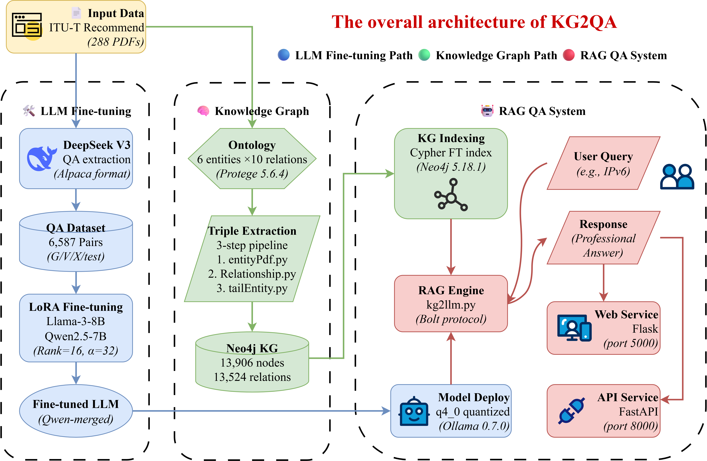








My Chinese name is 罗中泽. I am currently a CIE M.phil. in the [T-Lab](https://xiaoyingtang-cuhk.github.io/en) of [The Chinese University of Hong Kong, Shenzhen](https://sse.cuhk.edu.cn/en). Before this, I obtained a Bachelor of Engineering degree in Communication Engineering from [Northeast Forestry University](https://www.nefu.edu.cn/).

My research interests include Knowledge Graph, Multimodal Large Language Models, LLM reasoning and evaluation. I am still in the initial learning stage of my scientific research and have strong self-motivation.

You can find my CV here: [My Curriculum Vitae](../assets/CV.pdf). If you are interested in my work, please feel free to drop me an [email](mailto:luozhongze0928@foxmail.com) or add [My WeChat (微信)](../images/微信图片.jpg).

You are welcome to click [here](https://luozhongze.github.io/aboutlzz/) to visit **MyPhotoWall**.

# 🔥 News
- *now*: &nbsp;🎓🎓 I have **2** papers that have been submitted and are **under review**.
- *2025.08*: &nbsp;🎉🎉 New Conference Paper Accepted by PRICAI 2025 (short paper).
- *2025.06*: &nbsp;🎉🎉 New Journal Paper Accepted by Journal of Real-Time Image Processing 2025.
- *2025.04*: &nbsp;🎉🎉 New Conference Paper Accepted by IJCNN 2025. 
- *2024.11*: &nbsp;🎉🎉 New Conference Paper Accepted by COLING 2025 Oral. 
- *2024.04*: &nbsp;🎉🎉 New Journal Paper Accepted by Information Technology and Control 2024.  

# 🎉 Publications 

PRICAI 2025

[KG2QA: Knowledge Graph-enhanced Retrieval-Augmented Generation for Communication Standards Question Answering](https://arxiv.org/abs/2506.07037)

**Zhongze Luo**#, Weixuan Wan#, [Qizhi Zheng](http://zhengqizhi30.github.io), Yanhong Bai, [Jingyun Sun](https://ccec.nefu.edu.cn/info/1039/4807.htm), [Jian Wang](https://ccec.nefu.edu.cn/info/1043/1843.htm)$\spadesuit$, [Dan Wang](https://gr.xjtu.edu.cn/web/alexaustin)$\spadesuit$

[**Github**](https://github.com/luozhongze/KG2QA/) | In Proceedings of  the 22nd Pacific Rim International Conference on Artificial Intelligence (PRICAI) 2025 | **CCF C/CORE B/THCPL N**
- # Equal Contribution; $\spadesuit$ Corresponding authors

IJCNN 2025

[ForPKG: A Framework for Constructing Forestry Policy Knowledge Graph and Application Analysis](https://arxiv.org/abs/2411.11090v2)

[Jingyun Sun](https://nefujing.github.io), **Zhongze Luo***

[**Github**](https://github.com/luozhongze/ForPKG) | In Proceedings of the International Joint Conference on Neural Networks (IJCNN) 2025 | **CCF C/CORE B/THCPL B**

COLING 2025

[A Compliance Checking Framework Based on Retrieval Augmented Generation](https://aclanthology.org/2025.coling-main.178/)

[Jingyun Sun](https://nefujing.github.io), **Zhongze Luo**, [Yang Li](https://sites.google.com/site/liyang0525/home)*

In Proceedings of the 31st International Conference on Computational Linguistics (COLING) 2025 | **CCF B/CORE B/THCPL B**

JRTIP 2025

[HGO-YOLO: Advancing Anomaly Behavior Detection with Hierarchical Features and Lightweight Optimized Detection](https://arxiv.org/abs/2503.07371)

[Qizhi Zheng](http://zhengqizhi30.github.io), **Zhongze Luo**, Meiyan Guo, Xinzhu Wang, Renqimuge Wu, Qiu Meng, [Guanghui Dong](https://ccec.nefu.edu.cn/info/1043/1938.htm)*

**SCI Journal Paper (JCR Q2, IF:2.9)**
- Journal of Real-Time Image Processing, 22(4), 1-15.

ITC 2024

[Elderly Fall Detection Algorithm Based on Improved YOLOv5s](https://doi.org/10.5755/j01.itc.53.2.36336)

**Zhongze Luo**, Siying Jia, Hongjun Niu, Yifu Zhao, Xiaoyu Zeng, [Guanghui Dong](https://ccec.nefu.edu.cn/info/1043/1938.htm)*

[**Huggingface**](https://huggingface.co/datasets/luozhongze/YOLO-GCC) | **SCI Journal Paper (JCR Q3, IF:2)**
- Information Technology and Control, 53(2), 601-618.

# 📝 Preprints

Multi-Physics

[Multi-Physics: A Comprehensive Benchmark for Multimodel LLMs Reasoning on Chinese Multi-subject Physics Problems](https://luozhongze.github.io/Multi-Physics/paper.pdf)

**Zhongze Luo**, Zhenshuai Yin, Yongxin Guo, Jionghao Zhu, Zhichao Wang, Xiaoying Tang*

[**Github**](https://github.com/luozhongze/Multi-Physics) | **Under Review**

LawLuo

[LawLuo: A Multi-Agent Collaborative Framework for Multi-Round Chinese Legal Consultation](https://doi.org/10.48550/arXiv.2407.16252)

[Jingyun Sun](https://nefujing.github.io), [Chengxiao Dai](https://scholar.google.com/citations?user=9IYEVxcAAAAJ&hl=en), **Zhongze Luo**, Yangbo Chang, [Yang Li](https://sites.google.com/site/liyang0525/home)*

- arXiv preprint arXiv:2407.16252, 2024.

# 📖 Educations
- *2025.09 - Now*, Master of Philosophy, Computer and Information Engineering, [T-Lab](https://xiaoyingtang-cuhk.github.io/en) of The Chinese University of Hong Kong, Shenzhen, China. Supervised by [Prof. Xiaoying Tang](https://sse.cuhk.edu.cn/en/faculty/tangxiaoying).
- *2021.09 - 2025.06*, Bachelor of Communication Engineering, Northeast Forestry University, Harbin, China. Supervised by [Prof. Guanghui Dong](https://ccec.nefu.edu.cn/info/1043/1938.htm), [Prof. Jingyun Sun](https://nefujing.github.io), and [Prof. Yang Li](https://sites.google.com/site/liyang0525/home). You are welcome to click [here](https://luozhongze.github.io/KG2QA-thesis/) to view my undergraduate thesis, supervised by [Prof. Jian Wang](https://ccec.nefu.edu.cn/info/1043/1843.htm).

# 🔍 Internships
- *2025.03 - 2025.06*, [Xi'an Jiaotong University](https://eie.xjtu.edu.cn/en/info/1002/1002.htm), Xi'an, China. Supervised by [Prof. Dan Wang](https://gr.xjtu.edu.cn/web/alexaustin).
- *2025.01*, I am very honored to be a volunteer of [On Path to Multimodal Generalist: General-Level and General-Bench](https://generalist.top/) (ICML'25 Oral), you can see my name on the last page(305) of this [paper](https://arxiv.org/pdf/2505.04620).
- *2024.07 - 2025.01*, [CUHKSZ](https://sse.cuhk.edu.cn/en), Shenzhen, China. Supervised by [Prof. Xiaoying Tang](https://sse.cuhk.edu.cn/en/faculty/tangxiaoying).
- *2024.01 - 2024.03*, [BYD Company Limited](https://www.bydglobal.com/en/index.html), Shenzhen, China.

# ✨ Honors and Awards
- *2025.06* Outstanding Undergraduate Graduation Thesis of Northeast Forestry University (2/73, 3%)
- *2024.08* Chinese Collegiate Computing Competition - Third Prize
- *2022.11* Contemporary Undergraduate Mathematical Contest in Modeling - Provincial First Prize
- *2022.03* University scholarship - First Prize

# 📸 Miscellaneous

You are welcome to click [here](https://luozhongze.github.io/aboutlzz/) to visit **MyPhotoWall**.

There are many moments about me, including my hobbies, my Alma mater, and some other records of mine.

I believe that here you can have a more comprehensive and three-dimensional understanding of everything about me!
